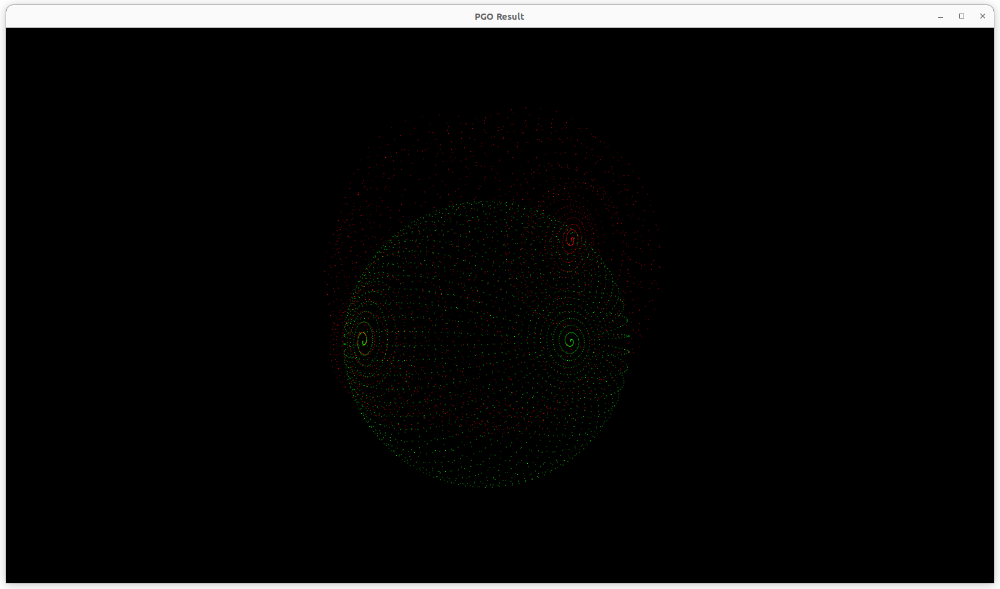

# pose-graph-optimization-implementation
- A project aiming to implement Pose Graph Optimization, a crucial topic in the field of SLAM.

## Requirements
- Eigen3
- Open3D(only for visualization)
- OpenMP

## Download g2o dataset
- [sphere.g2o](https://github.com/gaoxiang12/slambook2/blob/master/ch10/sphere.g2o)

## Clone and Build
```bash
git clone https://github.com/LimHaeryong/pose-graph-optimization-implementation.git
cd pose-graph-optimization-implementation
mkdir build && cd build
cmake .. && make
```

## Run
```
./pose_graph_3d {path/to/sphere.g2o} {num_iteration}
```

## Result



```bash
iteration = 10
total computeLinearSystem elapsed time : 0.242393(s)
total solver elapsed time : 2.24887(s)
total pose update elapsed time : 0.00193976(s)
```